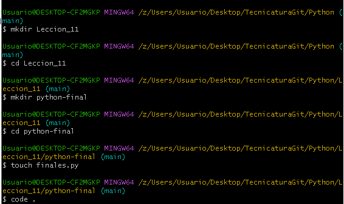
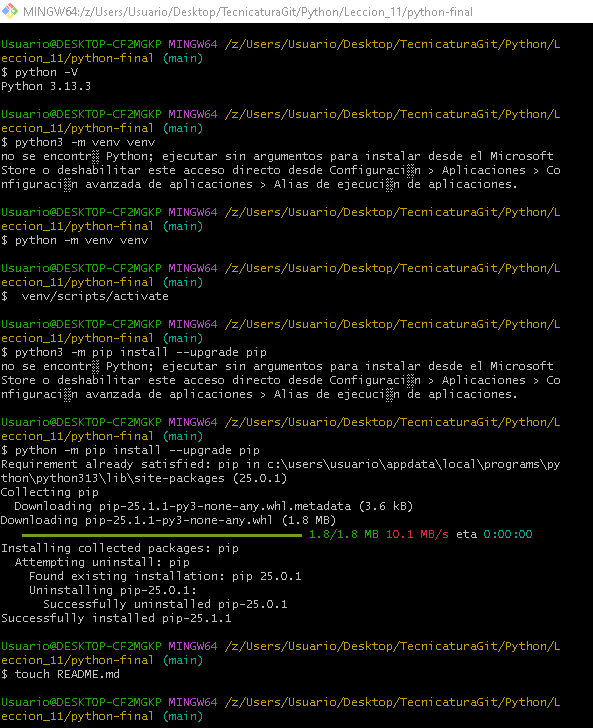

# Capturas de pantalla de la terminal
**Captura 1** 

**Captura 2**

# Actividad 11 - ¿Qué es el PIP y por qué lo actualizamos?

## ¿Qué es el Pip?

Pip es el gestor de paquetes oficial de Python. Su nombre viene de "Pip Installs Packages", y se usa para:

* Instalar paquetes o bibliotecas de Python desde PyPI (Python Package Index).

* Actualizar esos paquetes.

* Eliminar paquetes que ya no necesitamos.

* Ver qué paquetes tenemos instalados.

## ¿Por qué lo actualizamos?

Actualizar pip es importante por varias razones:

* Compatibilidad con nuevas versiones de Python
    Nuevas versiones de Python requieren un pip actualizado para evitar errores de instalación.

* Corrección de errores
    Cada nueva versión corrige errores que podrían hacer fallar instalaciones o causar conflictos.

* Nuevas funciones y mejoras
    Un pip más nuevo puede manejar mejor las dependencias, mostrar mensajes más claros o acelerar procesos.

* Seguridad
    Algunas actualizaciones corrigen vulnerabilidades que podrían afectar la seguridad del sistema.

